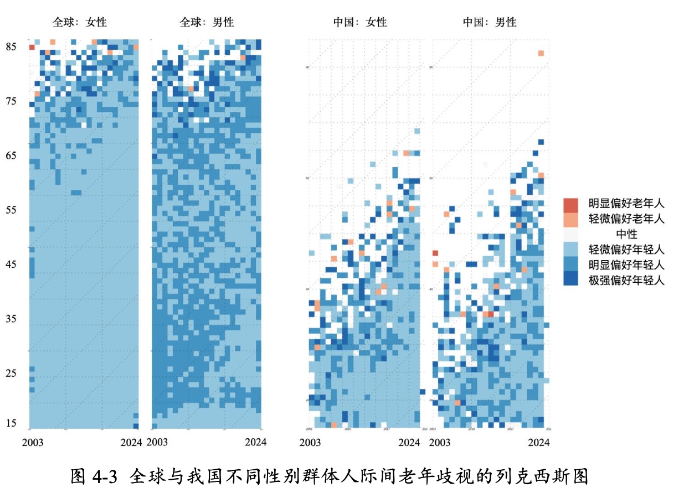

# Lexis Diagram简介

**Lexis Diagram** 是一种经典的人口学与流行病学可视化工具，用于在同一平面上同时展示 **年龄（Age）**、**历时（Period）** 与 **出生队列（Cohort）** 之间的关系。

---

## 一、概念与起源

Lexis Diagram 由德国人口学家 **Wilhelm Lexis（1837–1914）** 提出，用于描述个体生命历程及其在时间和年龄上的分布关系。

在社会统计与人口分析中，它是一种直观的二维坐标系统，将每个个体或群体的 “生–死” 或 “事件–暴露” 过程表示为一条**斜率为 45° 的线**。

---

## 二、基本构成

| 元素       | 含义                                      | 可视化形式                          |
|------------|-------------------------------------------|-------------------------------------|
| 横轴（X）  | 历时（Period / Calendar Time）             | 年份、时间点                        |
| 纵轴（Y）  | 年龄（Age）                               | 年龄或生存时间                      |
| 对角线（↗）| 出生队列（Cohort = Period − Age）         | 同一出生年的群体轨迹                |
| 线段       | 个体在研究期内的生存或观察时间（Life line） | 从进入期到退出期的连线              |
| 事件点     | 特定事件（死亡、发病、迁移、分娩等）      | 标记在线段上                        |
| 网格       | 划分时间与年龄单元（Grid）                | 通常为 1 年或 5 年区间              |

---

## 三、我学习绘制列克西斯图的过程和代码

我主要是学习了如何在R中绘制Lexis Surface Diagram，参考文献[Visualizing compositional data on the Lexis surface](https://www.demographic-research.org/articles/volume/36/21/),便于中文读者阅读我对这篇文章进行了翻译（[翻译版](https://github.com/Lingjun-Liu/Lexis_diagram/blob/main/Lexis翻译对照.pdf)）.关于Lexis Surface Diagram和Lexis Diagram的关系和区别在这篇文章中也有说明,主要是介绍了Lexis Surface Diagram的种类，然后基于HMD给示例代码绘制了三种Lexis Surface Diagram。

这个网页上其实已经提供了复现代码，我自己也跑了一下有些地方不理解没跑通的地方增加了一些修改和注释，将自己跑通的代码放在[这里](https://github.com/Lingjun-Liu/Lexis_diagram/tree/main/demographic-research.36-21)了。

> ⚠️注意：
 本仓库的 `demographic-research.36-21/code/example0-standard_lexis_surfaces.R` 已改为从环境变量读取 HMD（Human Mortality Database）账号密码，不再在代码中写明。
 请按以下步骤配置：
 1. 复制项目根目录下的 `.Renviron.example` 为 `.Renviron`
 2. 打开 `.Renviron`，填写：
   - `HMD_USERNAME=你的HMD邮箱`
   - `HMD_PASSWORD=你的HMD密码`
 3. 重新启动 R 会话，或执行 `readRenviron(".Renviron")`
 4. 运行脚本时会自动读取 `HMD_USERNAME` 与 `HMD_PASSWORD`。

 注意：`.Renviron` 已加入 `.gitignore`，不会被提交。

## 四、我的博士论文中绘制的Lexis Diagram代码

我的博士论文是研究老年歧视的，其中有一个维度就是人际间老年歧视也就是各个年龄段群体对于老年人的内隐态度。这个主要是我基于[Age—IAT](https://osf.io/search?search=Age%20IAT)数据绘制的。
数据集比较大使用了kaggle完成了绘制，前期进行了一些数据出了这里只展示绘制的步骤：[代码](https://github.com/Lingjun-Liu/Lexis_diagram/blob/main/step2-iat-global-cn-lexis.ipynb)

绘制了全球和中国不同性别群体人际间老年歧视对比图：

