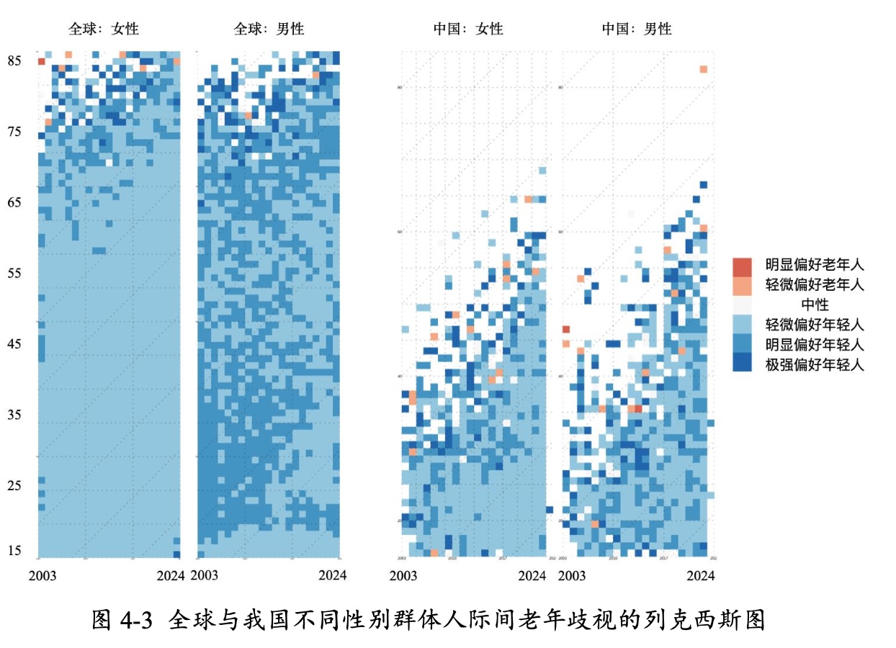

# Lexis Diagram简介

**Lexis Diagram** 是一种经典的人口学与流行病学可视化工具，用于在同一平面上同时展示 **年龄（Age）**、**历时（Period）** 与 **出生队列（Cohort）** 之间的关系。

---

## 一、概念与起源

Lexis Diagram 由德国人口学家 **Wilhelm Lexis（1837–1914）** 提出，用于描述个体生命历程及其在时间和年龄上的分布关系。

在社会统计与人口分析中，它是一种直观的二维坐标系统，将每个个体或群体的 “生–死” 或 “事件–暴露” 过程表示为一条**斜率为 45° 的线**。

---

## 二、基本构成

| 元素       | 含义                                      | 可视化形式                          |
|------------|-------------------------------------------|-------------------------------------|
| 横轴（X）  | 历时（Period / Calendar Time）             | 年份、时间点                        |
| 纵轴（Y）  | 年龄（Age）                               | 年龄或生存时间                      |
| 对角线（↗）| 出生队列（Cohort = Period − Age）         | 同一出生年的群体轨迹                |
| 线段       | 个体在研究期内的生存或观察时间（Life line） | 从进入期到退出期的连线              |
| 事件点     | 特定事件（死亡、发病、迁移、分娩等）      | 标记在线段上                        |
| 网格       | 划分时间与年龄单元（Grid）                | 通常为 1 年或 5 年区间              |

---

## 三、我学习绘制列克西斯图的过程和代码

我主要是学习了如何在R中绘制Lexis Surface Diagram，参考文献[Visualizing compositional data on the Lexis surface](https://www.demographic-research.org/articles/volume/36/21/),便于中文读者阅读我对这篇文章进行了翻译（[翻译版](https://github.com/Lingjun-Liu/Lexis_diagram/blob/main/Lexis翻译对照.pdf)）.关于Lexis Surface Diagram和Lexis Diagram的关系和区别在这篇文章中也有说明,主要是介绍了Lexis Surface Diagram的种类，然后基于HMD给示例代码绘制了三种Lexis Surface Diagram。

这个网页上其实已经提供了复现代码，我自己也跑了一下有些地方不理解没跑通的地方增加了一些修改和注释，将自己跑通的代码放在[这里](https://github.com/Lingjun-Liu/Lexis_diagram/tree/main/demographic-research.36-21)了。

> ⚠️注意：
 本仓库的 `demographic-research.36-21/code/example0-standard_lexis_surfaces.R` 已改为从环境变量读取 HMD（Human Mortality Database）账号密码，不再在代码中写明。
 请按以下步骤配置：
 1. 复制项目根目录下的 `.Renviron.example` 为 `.Renviron`
 2. 打开 `.Renviron`，填写：
   - `HMD_USERNAME=你的HMD邮箱`
   - `HMD_PASSWORD=你的HMD密码`
 3. 重新启动 R 会话，或执行 `readRenviron(".Renviron")`
 4. 运行脚本时会自动读取 `HMD_USERNAME` 与 `HMD_PASSWORD`。

 注意：`.Renviron` 已加入 `.gitignore`，不会被提交。

## 四、我的博士论文中绘制的 Lexis Diagram 代码

我的博士论文研究老年歧视，其中人际间老年歧视指各年龄段群体对老年人的内隐与外显态度。分析基于 [Age—IAT](https://osf.io/search?search=Age%20IAT) 公开数据（2002–2024），因数据量较大，清洗与加权在 [Kaggle](https://www.kaggle.com/) 上完成，列克西斯图在清洗后的加权数据上绘制。

### 4.1 数据清洗

[`step1-ageism-0224-iat-weight.ipynb`](step1-ageism-0224-iat-weight.ipynb) 将原始 SPSS 数据整理为可供列克西斯图使用的分析表，主要步骤如下：

1. **导入与变量筛选**  
   读取 `Age IAT.public.2002-2024.sav`，保留会话 ID、年龄/出生年/调查年、性别相关字段、外显态度（`att_5` / `att_7`）、IAT 得分与质量指标（`D_biep.Young_Good_all`、错误率、反应时等）以及国籍字段。

2. **年龄—历时—队列（Lexis 三要素）**  
   - 将 `age`、`birthyear`、`year` 限制在合理区间（年龄 15–89 岁，出生年 1901–2024，调查年 2002–2024）。  
   - 在 `age`、`birthyear`、`year` 中至多允许 1 个缺失，并用关系 **队列 = 历时 − 年龄** 互相补全，得到 `Age`、`Period`、`Cohort`。  
   - 检查三者在非缺失时是否一致，最终仅保留年龄 15–89 岁的观测。

3. **性别统一**  
   不同年份问卷的性别变量不同：2015 年及以前用 `sex`，2016–2022 年用 `birthsex`，2023–2024 年用 `genderIdentity_0002`；合并为统一的 `Sex`（1 = 男，2 = 女）。2023–2024 年另剔除非二元性别标识（3、4）及跨性别者（`transIdentity == 1`），以保证与人口学加权结构一致。

4. **因变量构造与 IAT 质控**  
   - **外显态度 `Att`**：优先使用 5 点量表 `att_5`；缺失时将 7 点 `att_7` 线性缩放到 1–5 后填补。  
   - **内隐态度（IAT）**：以 `D_biep.Young_Good_all`（Young–Good D 分数）为主；按 Greenwald 等常用标准剔除：总错误率 > 30%、任一分区错误率 > 40%、过快反应（<400 ms）占比过高等。清洗后样本约 **245 万** 条（相对原始约 276 万条）。

5. **国籍（ISO）编码**  
   2016–2024 年间国籍字段有多次调整；按优先级合并 `countrycit003_num` → `countrycit_num` → `countrycit` → `country`，清洗无效编码后对照 `country.xlsx` 转为 **ISO 两位字母**（`country_iso`）。

6. **WPP 事后加权**  
   用联合国《世界人口展望》（WPP）分国别、年份、性别、5 岁年龄组（15–89）的真实人口结构，与样本结构对比，计算 **事后权重 = 总体比例 ÷ 样本比例**，合并为 `post_weight`。最后仅保留各国样本量 **> 2000** 的国家，在 notebook 中导出为 `survey_data_weighted_filtered.csv`（未纳入本仓库，需自行运行 step1 生成）。

```mermaid
flowchart LR
  A[Age IAT .sav] --> B[变量筛选]
  B --> C[Age / Period / Cohort]
  C --> D[性别统一]
  D --> E[Att + IAT 质控]
  E --> F[country_iso]
  F --> G[WPP 事后加权]
  G --> H[step2 列克西斯图]
```

> **运行环境**：step1 在 Kaggle 上运行，需挂载 Age—IAT 数据集、`population.xlsx`（WPP）及 `country.xlsx` 对照表；本地复现请修改 notebook 中的读入路径。

### 4.2 列克西斯图绘制

在 step1 输出的加权数据基础上，[`step2-iat-global-cn-lexis.ipynb`](step2-iat-global-cn-lexis.ipynb) 完成聚合与作图。

绘制了全球和中国不同性别群体人际间老年歧视对比图：

